<h2>TensorFlow-FlexUNet-Image-Segmentation-Multiclass-Brain-Hemorrhage-25 (2025/11/09)</h2>

Toshiyuki Arai 
Software Laboratory antillia.com 
 
This is the first experiment of Image Segmentation for Multiclass Brain Hemorrhage (MBH-Seg25),
 based on our 
TensorFlowFlexUNet (TensorFlow Flexible UNet Image Segmentation Model for Multiclass) 
and a 512x512 pixels PNG 
<a href="https://drive.google.com/file/d/1TJ99eynP5Z69voFqrFWSk4f7fwcu3RQZ/view?usp=sharing">
MBH-Seg25-ImageMask-Dataset.zip,
</a>
which was derived by us from   
<a href="https://huggingface.co/datasets/mbhseg/mbhseg25/resolve/main/MBH_Train_2025_voxel-label.zip?download=true">
MBH_Train_2025_voxel-label.zip
</a>
in 
<a href="https://huggingface.co/datasets/mbhseg/mbhseg25">
<b>
MBH-Seg25: Multi-class Brain Hemorrhage Segmentation in Non-conrast CT</b>
</a>
 
 

<b>Acutual Image Segmentation for 512x512 pixels Brain Hemorrhage</b> 
As shown below, the inferred masks predicted by our segmentation model trained on the 
PNG dataset appear similar to the ground truth masks, but they lack precision in certain areas. 
<b>rgb_map (EDH:red, IPH:blue    IVH:violet     SAH:yellow,   SDH:green)) </b>
 
<table>
<tr>
<th>Input: image</th>
<th>Mask (ground_truth)</th>
<th>Prediction: inferred_mask</th>
</tr>
<tr>
<td>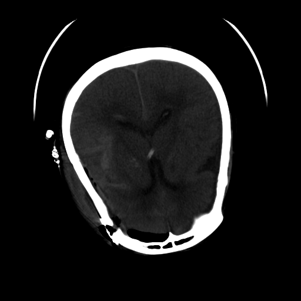</td>
<td>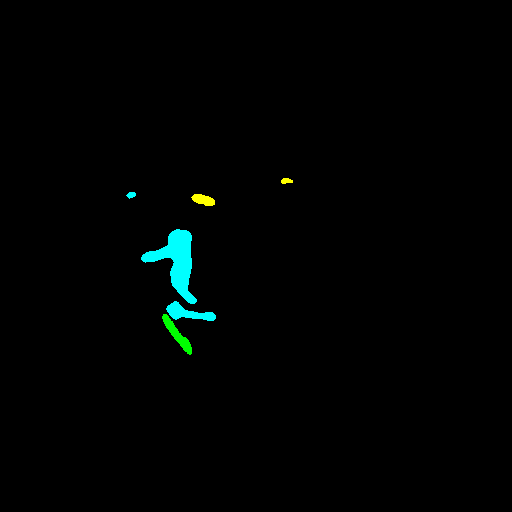</td>
<td>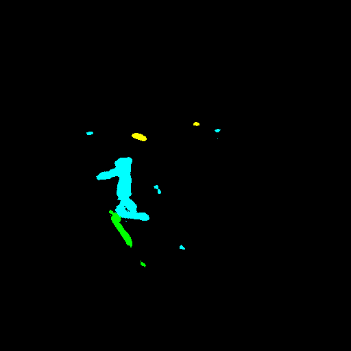</td>
</tr>
<tr>
<td>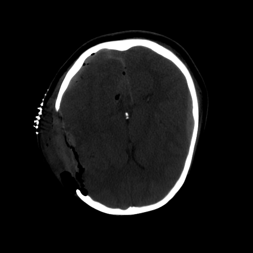</td>
<td>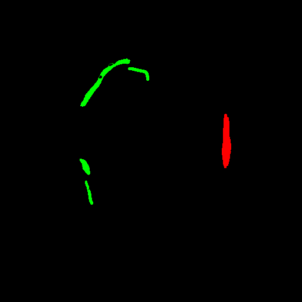</td>
<td>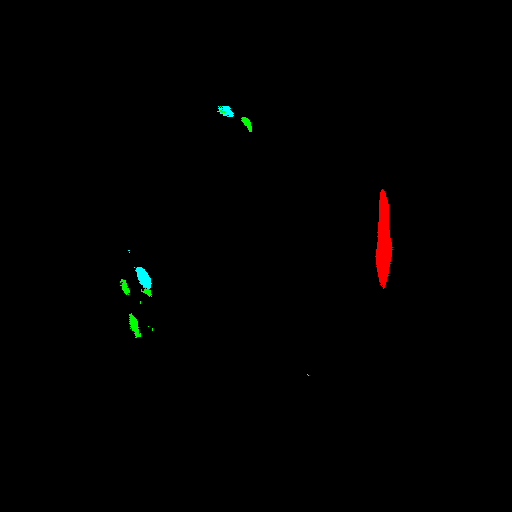</td>
</tr>
<tr>
<td>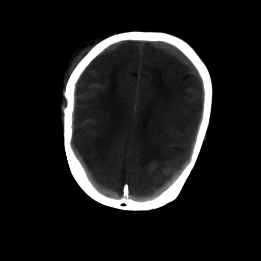</td>
<td>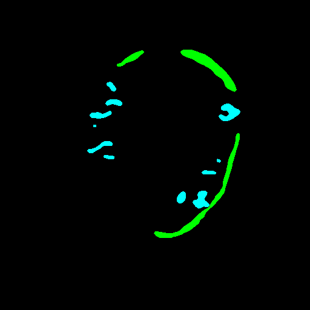</td>
<td></td>
</tr>
</table>

<h3>1. Dataset Citation</h3>
The dataset used was derived from:  
<a href="https://huggingface.co/datasets/mbhseg/mbhseg25/resolve/main/MBH_Train_2025_voxel-label.zip?download=true">
MBH_Train_2025_voxel-label.zip
</a>  
Contains 192 volumes with voxel-level annotations (from four different annotators)
 
in <a href="https://huggingface.co/datasets/mbhseg/mbhseg25">
<b>
MBH-Seg25: Multi-class Brain Hemorrhage Segmentation in Non-contrast CT</b>
</a>
  
<a href="https://www.mbhseg.com/">
<b>MBH-Seg25: Multi-class Brain Hemorrhage Segmentation in Non-contrast CT</b>
</a>
  
<b>Overview</b> 
We warmly invite you to participate in the second edition of the MICCAI MBH-Seg25 Challenge on multi-class brain hemorrhage segmentation from non-contrast CT scans. Accurate segmentation of different hemorrhage subtypes—such as subdural, epidural, intraparenchymal, and subarachnoid—is critical for timely diagnosis, treatment planning, and clinical decision-making. Each type of hemorrhage carries distinct prognostic and therapeutic implications, underscoring the need for precise and reliable delineation. Currently, diagnosis primarily depends on expert radiologists interpreting non-contrast CT scans—a process that is time-consuming and prone to inter-observer variability. This challenge aims to transform traditional workflows by promoting the development of advanced AI-driven segmentation methods that enable faster, more consistent, and more accurate diagnosis, ultimately reducing mortality and improving patient outcomes. 
Building on the success of last year’s challenge, MBH-Seg25 introduces new settings that better reflect real-world clinical scenarios and data constraints:  
1. We incorporate multi-rater annotations to capture variability among experts, encouraging the development of algorithms that can handle disagreements and uncertainty in medical data.
 
2. We provide extra weakly-labeled cases with case-level labels to simulate scenarios where detailed annotations are unavailable, promoting research into methods that make the most of limited or less granular data.
  
<b>Licence</b> 
<a href="https://choosealicense.com/licenses/mit/">
MIT
</a>
 
 
<h3>
<a id="2">
2 MBH-Seg25 ImageMask Dataset
</a>
</h3>
<h4>2.1 Download ImageMask Dataset</h4>
 If you would like to train this MBH Segmentation model by yourself,
 please download the dataset from the google drive 
<a href="https://drive.google.com/file/d/1TJ99eynP5Z69voFqrFWSk4f7fwcu3RQZ/view?usp=sharing">
MBH-Seg25-ImageMask-Dataset.zip</a> , expand the downloaded dataset, and put it under <b>./dataset</b> folder to be
<pre>
./dataset
└─MBH-Seg25
    ├─test
    │   ├─images
    │   └─masks
    ├─train
    │   ├─images
    │   └─masks
    └─valid
        ├─images
        └─masks
</pre>
 
<b>MBH Statistics</b> 
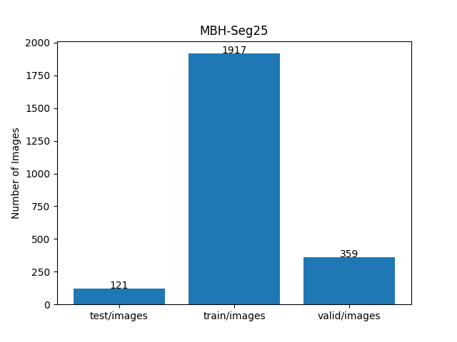 
 
As shown above, the number of images of train and valid datasets is not so large to use for a training set of our segmentation model.
 
 
We derived this PNG dataset from 
<a href="https://huggingface.co/datasets/mbhseg/mbhseg25/resolve/main/MBH_Train_2025_voxel-label.zip?download=true">
MBH_Train_2025_voxel-label.zip
</a>, which contains 192 volumes with voxel-level annotations (from four different annotators), 
 
by a similar way used in <a href="https://github.com/sarah-antillia/TensorFlow-FlexUNet-Image-Segmentation-Multiclass-Brain-Hemorrhage">
TensorFlow-FlexUNet-Image-Segmentation-Multiclass-Brain-Hemorrhage</a>, although the voxel-label dataset contains multiple annotations
by the four experts. 
 
 
<b>Train_images_sample</b> 
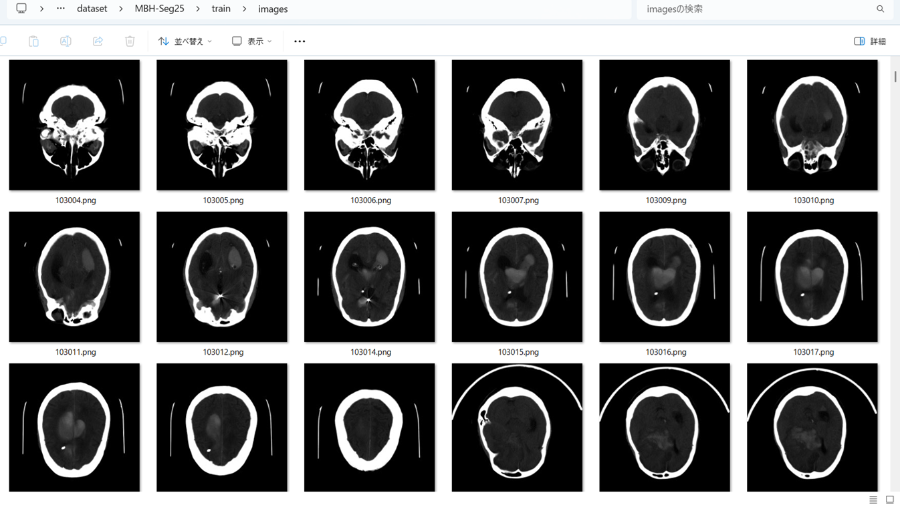
 
<b>Train_masks_sample</b> 
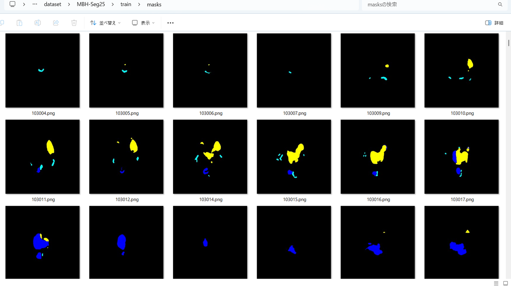
 
 
<h3>
3 Train TensorFlowFlexUNet Model
</h3>
 We trained MBH TensorFlowFlexUNet Model by using the following
<a href="./projects/TensorFlowFlexUNet/MBH-Seg25/train_eval_infer.config"> <b>train_eval_infer.config</b></a> file.  
Please move to ./projects/TensorFlowFlexUNet/MBH-Seg25 and run the following bat file. 
<pre>
>1.train.bat
</pre>
, which simply runs the following command. 
<pre>
>python ../../../src/TensorFlowFlexUNetTrainer.py ./train_eval_infer.config
</pre>

<b>Model parameters</b> 
Defined a small <b>base_filters = 16 </b> and large <b>base_kernels = (7,7)</b> for the first Conv Layer of Encoder Block of 
<a href="./src/TensorFlowFlexUNet.py">TensorFlowFlexUNet.py</a> 
and a large num_layers (including a bridge between Encoder and Decoder Blocks).
<pre>
[model]
;You may specify your own UNet class derived from our TensorFlowFlexModel
model         = "TensorFlowFlexUNet"
generator     =  False
image_width    = 512
image_height   = 512
image_channels = 3
num_classes    = 6

base_filters   = 16
base_kernels   = (7,7)
num_layers     = 8
dropout_rate   = 0.05
dilation       = (1,1)
</pre>
<b>Learning rate</b> 
Defined a very small learning rate.  
<pre>
[model]
learning_rate  = 0.00005
</pre>
<b>Loss and metrics functions</b> 
Specified "categorical_crossentropy" and <a href="./src/dice_coef_multiclass.py">"dice_coef_multiclass"</a>. 
<pre>
[model]
loss           = "categorical_crossentropy"
metrics        = ["dice_coef_multiclass"]
</pre>
<b>Dataset class</b> 
Specifed <a href="./src/ImageCategorizedMaskDataset.py">ImageCategorizedMaskDataset</a> class. 
<pre>
[dataset]
class_name    = "ImageCategorizedMaskDataset"
</pre>
 
<b>Learning rate reducer callback</b> 
Enabled learing_rate_reducer callback, and a small reducer_patience.
<pre> 
[train]
learning_rate_reducer = True
reducer_factor     = 0.5
reducer_patience   = 4
</pre>
<b>Early stopping callback</b> 
Enabled early stopping callback with patience parameter.
<pre>
[train]
patience      = 10
</pre>

<b>RGB Color map</b> 
rgb color map dict for MBH 1+5 classes. 
<pre>
[mask]
mask_file_format = ".png"
;                     EDH:red,    IPH:blue    IVH:yellow     SAH:cyan,   SDH:green
rgb_map = {(0,0,0):0,(255,0,0):1,(0,0,255):2, (255,255,0):3, (0,255,255):4,(0,255,0):5}
</pre>

<b>Epoch change inference callback</b> 
Enabled <a href="./src/EpochChangeInfereuncer.py">epoch_change_infer callback</a></b>. 
<pre>
[train]
epoch_change_infer       = True
epoch_change_infer_dir   =  "./epoch_change_infer"
num_infer_images         = 6
</pre>

By using this callback, on every epoch_change, the inference procedure can be called
 for 6 images in <b>mini_test</b> folder. This will help you confirm how the predicted mask changes 
 at each epoch during your training process.    

<b>Epoch_change_inference output at starting (epoch 1,2,3)</b> 
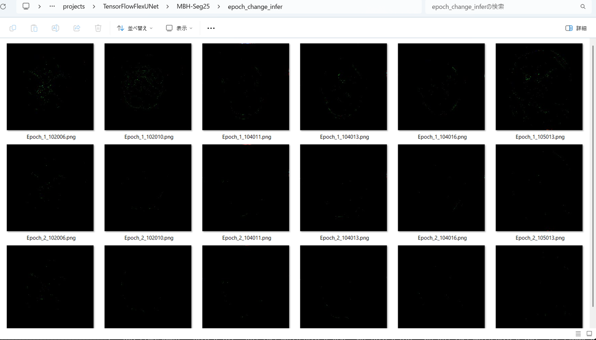 
 
<b>Epoch_change_inference output at middlepoint (epoch 31,32,33)</b> 
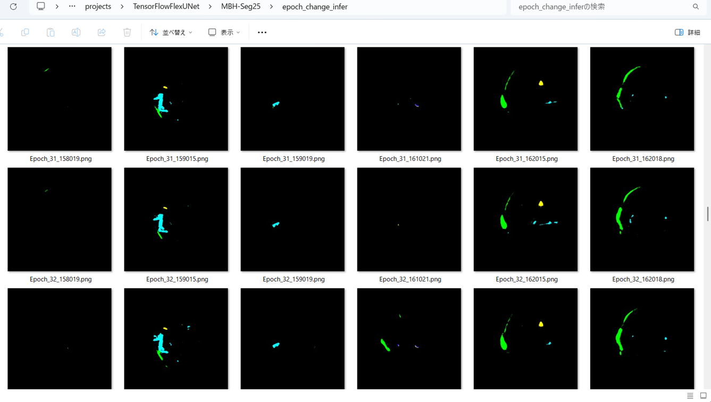 
 
<b>Epoch_change_inference output at ending (epoch 62,63,64)</b> 
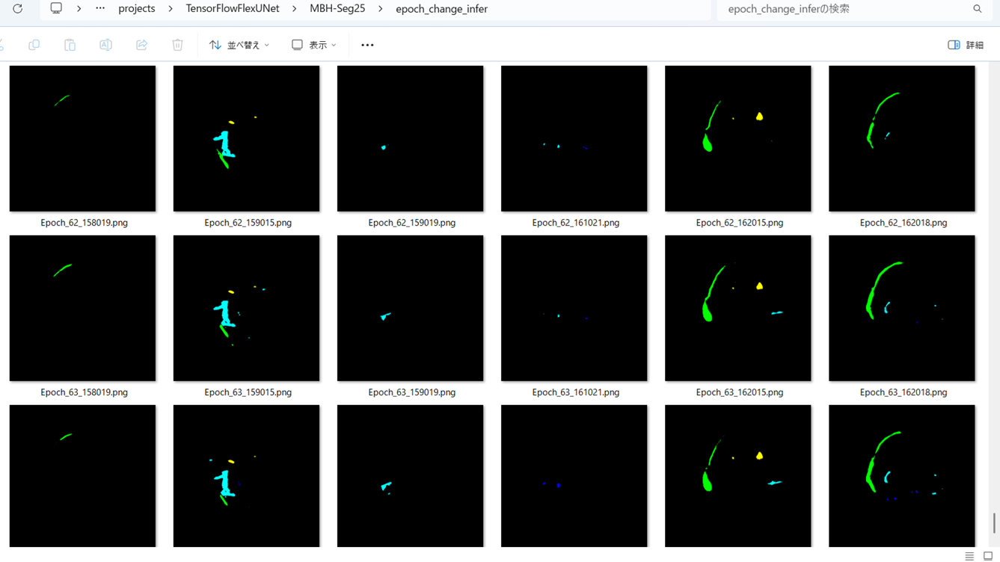 
 
In this experiment, the training process was stopped at epoch 64 by EearlyStopping callback.  
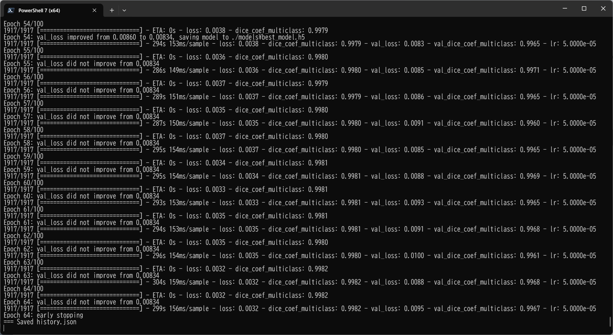 
 

<a href="./projects/TensorFlowFlexUNet/MBH-Seg25/eval/train_metrics.csv">train_metrics.csv</a> 
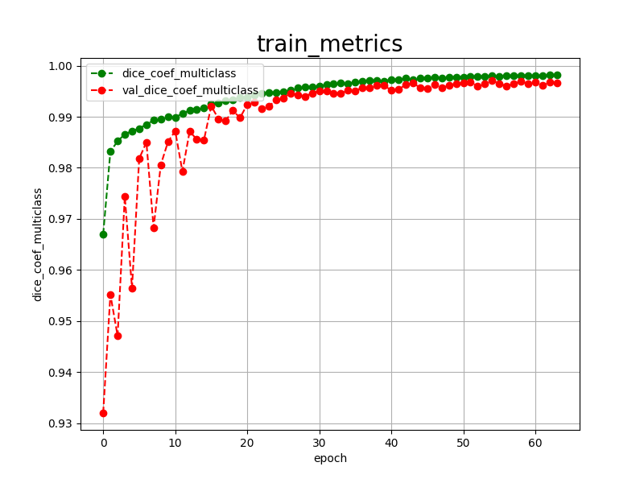 

 
<a href="./projects/TensorFlowFlexUNet/MBH-Seg25/eval/train_losses.csv">train_losses.csv</a> 
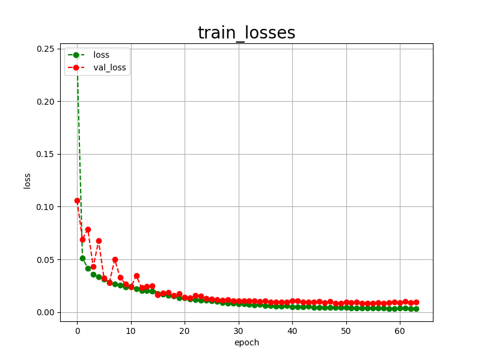 

 

<h3>
4 Evaluation
</h3>
Please move to <b>./projects/TensorFlowFlexUNet/MBH-Seg25</b> folder, 
and run the following bat file to evaluate TensorFlowFlexUNet model for MBH. 
<pre>
./2.evaluate.bat
</pre>
This bat file simply runs the following command.
<pre>
python ../../../src/TensorFlowFlexUNetEvaluator.py ./train_eval_infer.config
</pre>

Evaluation console output: 
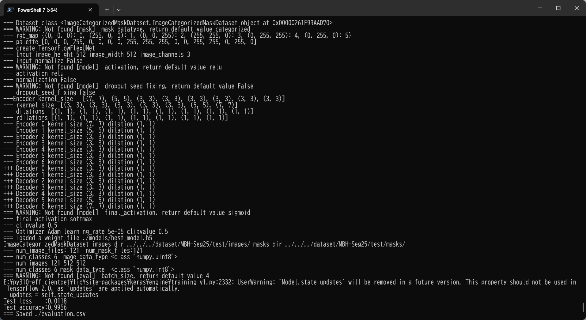
  

<a href="./projects/TensorFlowFlexUNet/MBH-Seg25/evaluation.csv">evaluation.csv</a> 
The loss (categorical_crossentropy) to this MBH-Seg25/test was not low, but dice_coef_multiclass 
high as shown below.
 
<pre>
categorical_crossentropy,0.0118
dice_coef_multiclass,0.9956
</pre>
 

<h3>
5 Inference
</h3>
Please move <b>./projects/TensorFlowFlexUNet/MBH-Seg25</b> folder 
,and run the following bat file to infer segmentation regions for images by the Trained-TensorFlowFlexUNet model for MBH. 
<pre>
./3.infer.bat
</pre>
This simply runs the following command.
<pre>
python ../../../src/TensorFlowFlexUNetInferencer.py ./train_eval_infer.config
</pre>

<b>mini_test_images</b> 
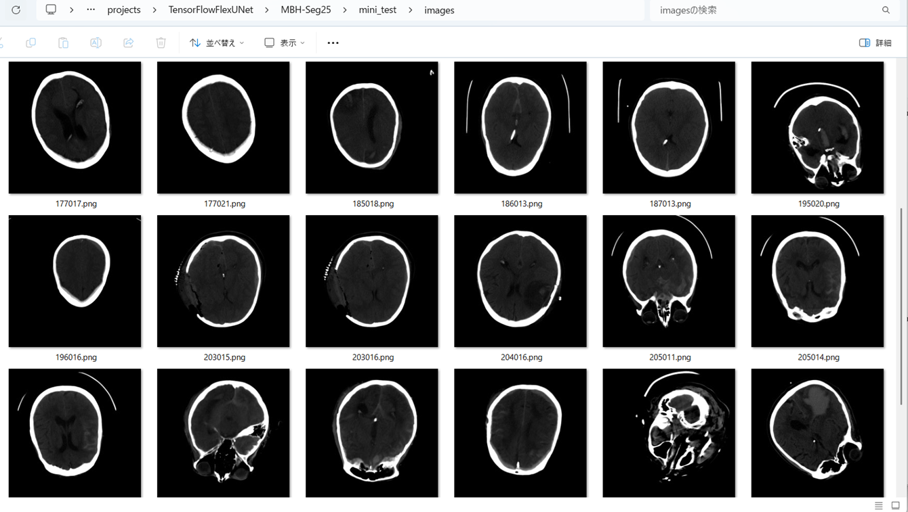 
<b>mini_test_mask(ground_truth)</b> 
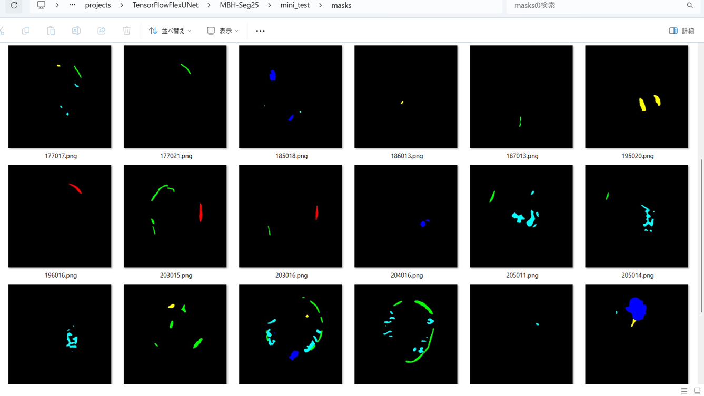 

<b>Inferred test masks</b> 
 
 

<b>Enlarged images and masks of 512x512 pixels Brain Hemorrhage</b> 
As shown below, the inferred masks predicted by our segmentation model trained on the 
PNG dataset appear similar to the ground truth masks, but they lack precision in certain areas. 
rgb_map (EDH:red,    IPH:blue    IVH:yellow     SAH:cyan,   SDH:green) 
<table>
<tr>
<th>Image</th>
<th>Mask (ground_truth)</th>
<th>Inferred-mask</th>
</tr>

<tr>
<td>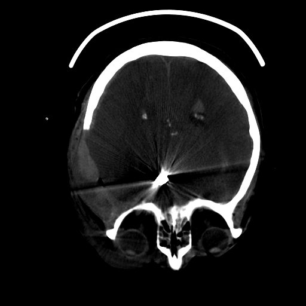</td>
<td>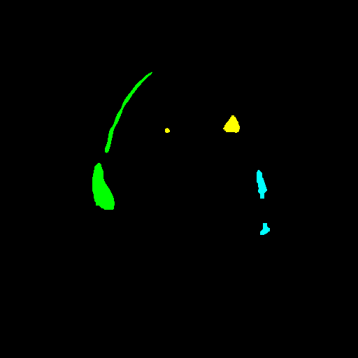</td>
<td>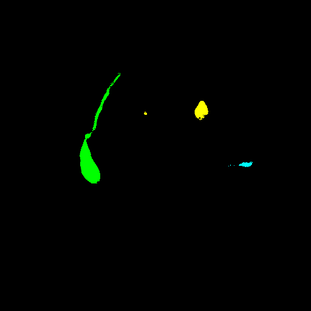</td>
</tr>

<tr>
<td>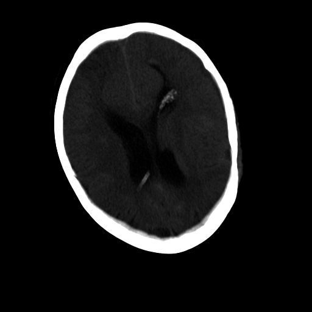</td>
<td>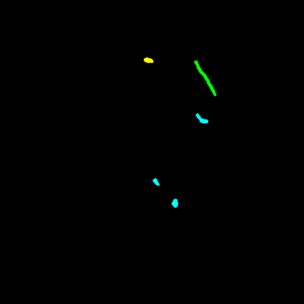</td>
<td>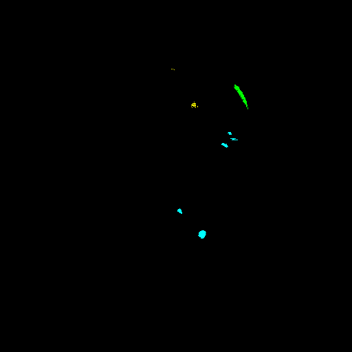</td>
</tr>

<tr>
<td></td>
<td></td>
<td></td>
</tr>

<!-- 
OK
 -->
<tr>
<td>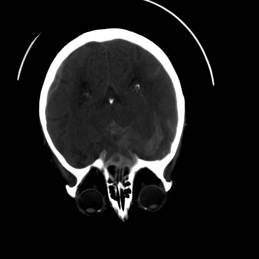</td>
<td></td>
<td></td>
</tr>

<tr>
<td></td>
<td></td>
<td></td>
</tr>

<tr>
<td>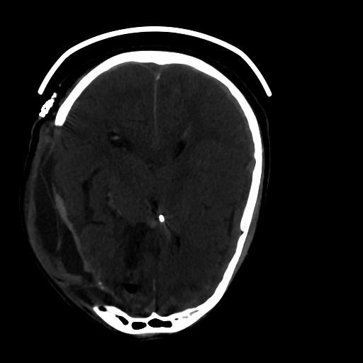</td>
<td>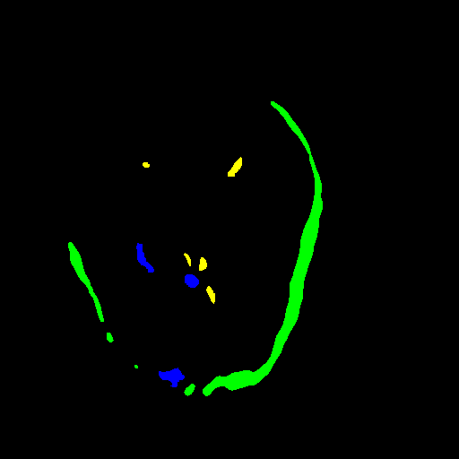</td>
<td>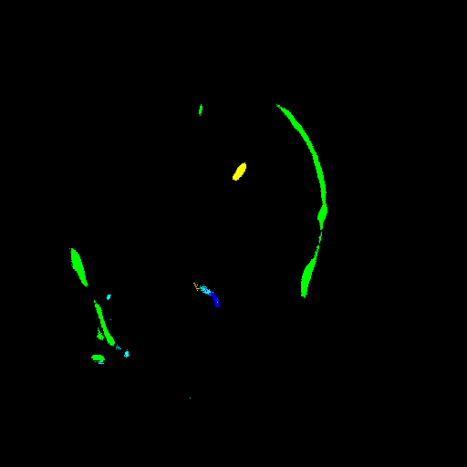</td>
</tr>
</table>

 
<h3>
References
</h3>
<b>1. MICCAI2025 MBH-Seg Challenge</b> 
Wang, Dongang, Xie, Yutong, Wang, Chenyu, Barnett, Michael, Wu, Qi 
Chen, Siqi, Wang, Hengrui, Tang, Zihao, Ma, Yang, An Hong, An Thien 
<a href="https://zenodo.org/records/15094748">https://zenodo.org/records/15094748</a>
 
 
<b>2. MBH-Seg25: Multi-class Brain Hemorrhage Segmentation in Non-contrast CT</b> 
<a href="https://www.mbhseg.com/">
https://www.mbhseg.com/
</a>">
 
 
<b>3. Multi-Rater Brain Hemorrhage Segmentation Dataset (MR-BHSD)</b> 
<b>MBH-Seg25: Multi-class Brain Hemorrhage Segmentation in Non-conrast CT</b> 
 
<a href="https://huggingface.co/datasets/mbhseg/mbhseg25">
https://huggingface.co/datasets/mbhseg/mbhseg25
</a>
 
 
<b>4. MBH-Seg25: Multi-class Brain Hemorrhage Segmentation in Non-contrast CT </b> 
CodeCat 
<a href="https://github.com/codecat0/MBH-Seg-25">
https://github.com/codecat0/MBH-Seg-25
</a>
 
 
<b>5. TensorFlow-FlexUNet-Image-Segmentation-Multiclass-Brain-Hemorrhage</b> 
Toshiyuki Arai 
<a href="https://github.com/sarah-antillia/TensorFlow-FlexUNet-Image-Segmentation-Multiclass-Brain-Hemorrhage">
https://github.com/sarah-antillia/TensorFlow-FlexUNet-Image-Segmentation-Multiclass-Brain-Hemorrhage
</a>
 
 
<b>6. TensorFlow-FlexUNet-Image-Segmentation-Model</b> 
Toshiyuki Arai antillia.com 
<a href="https://github.com/sarah-antillia/TensorFlow-FlexUNet-Image-Segmentation-Model">
https://github.com/sarah-antillia/TensorFlow-FlexUNet-Image-Segmentation-Model
</a>

